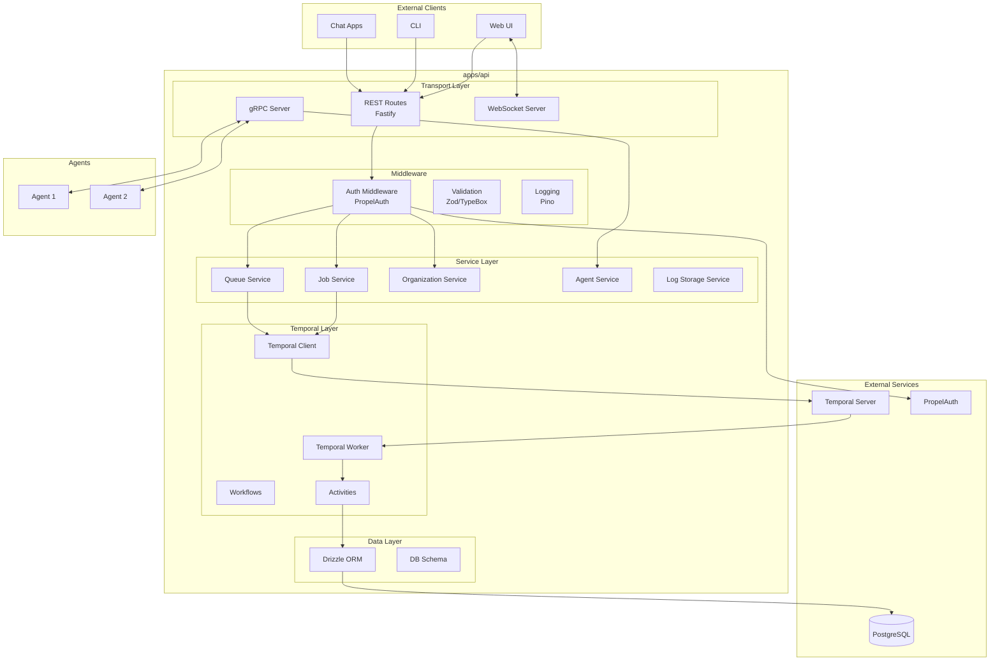

# Design Document: API Server

## Overview

The SIA Backend API Server is a Fastify-based Node.js application that serves as the central hub for the SIA platform. It handles REST API requests, gRPC agent communication, WebSocket real-time updates, and Temporal workflow orchestration.

## Architecture



## Directory Structure

```
apps/api/src/
├── routes/                 # REST API routes
│   ├── jobs/              # Job management routes
│   ├── queues/            # Queue management routes
│   ├── organizations/     # Organization routes
│   └── agents/            # Agent management routes
├── services/              # Business logic services
│   ├── job-service.ts
│   ├── queue-service.ts
│   ├── agent-client.ts
│   ├── log-storage.ts
│   └── websocket-manager.ts
├── temporal/              # Temporal integration
│   ├── workflows/         # Workflow definitions
│   ├── activities/        # Activity implementations
│   ├── client.ts          # Temporal client
│   └── worker.ts          # Temporal worker
├── db/                    # Database layer
│   ├── schema.ts          # Drizzle schema
│   ├── index.ts           # DB connection
│   └── migrations/        # SQL migrations
├── middleware/            # Fastify middleware
│   ├── auth.ts            # Authentication
│   └── validation.ts      # Request validation
├── grpc/                  # gRPC server
│   └── agent-server.ts
└── main.ts                # Application entry point
```

## Components

### REST API Routes

| Route | Method | Description |
|-------|--------|-------------|
| `/api/jobs` | GET | List jobs for organization |
| `/api/jobs` | POST | Create new job |
| `/api/jobs/:id` | GET | Get job details |
| `/api/jobs/:id/cancel` | POST | Cancel running job |
| `/api/jobs/:id/logs` | GET | Get job logs |
| `/api/queues/:type` | GET | Get queue status |
| `/api/queues/:type/reorder` | POST | Reorder queue |
| `/api/organizations/:id` | GET | Get organization |
| `/api/agents` | GET | List agents |
| `/api/agents/:id` | GET | Get agent details |

### Database Schema

```typescript
// Key tables
jobs: {
  id: uuid,
  version: integer,
  orgId: uuid,
  status: enum('draft', 'queued', 'in-progress', 'in-review', 'completed', 'failed'),
  queueType: enum('backlog', 'rework'),
  orderInQueue: integer,
  prompt: text,
  repoId: uuid,
  prLink: text,
  createdAt: timestamp,
  updatedAt: timestamp
}

agents: {
  id: uuid,
  orgId: uuid,
  name: text,
  host: text,
  port: integer,
  status: enum('active', 'offline'),
  consecutiveFailures: integer,
  lastActive: timestamp
}

organizations: {
  id: uuid,
  name: text,
  propelAuthOrgId: text
}
```

## Correctness Properties

### Property 1: Request Authentication
*For any* REST API request to a protected endpoint, the system SHALL verify the PropelAuth JWT token before processing.
**Validates: Requirements 3.1**

### Property 2: Organization Isolation
*For any* data query, the system SHALL filter results by the authenticated user's organization.
**Validates: Requirements 3.2**

### Property 3: WebSocket Subscription Cleanup
*For any* WebSocket disconnection, the system SHALL remove all subscriptions for that client.
**Validates: Requirements 5.3**

### Property 4: Log Persistence
*For any* log message received from an agent, the system SHALL persist it to the database before broadcasting.
**Validates: Requirements 2.3**

## Error Handling

- **400 Bad Request**: Invalid input data
- **401 Unauthorized**: Missing or invalid authentication
- **403 Forbidden**: Insufficient permissions
- **404 Not Found**: Resource not found
- **500 Internal Server Error**: Unexpected server errors

## Testing Strategy

- Unit tests for services
- Integration tests for routes
- Property-based tests for data validation
- Mock gRPC for agent communication tests
