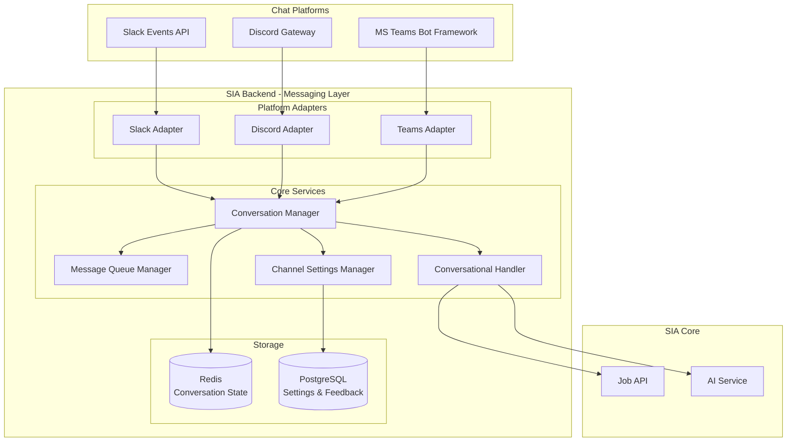
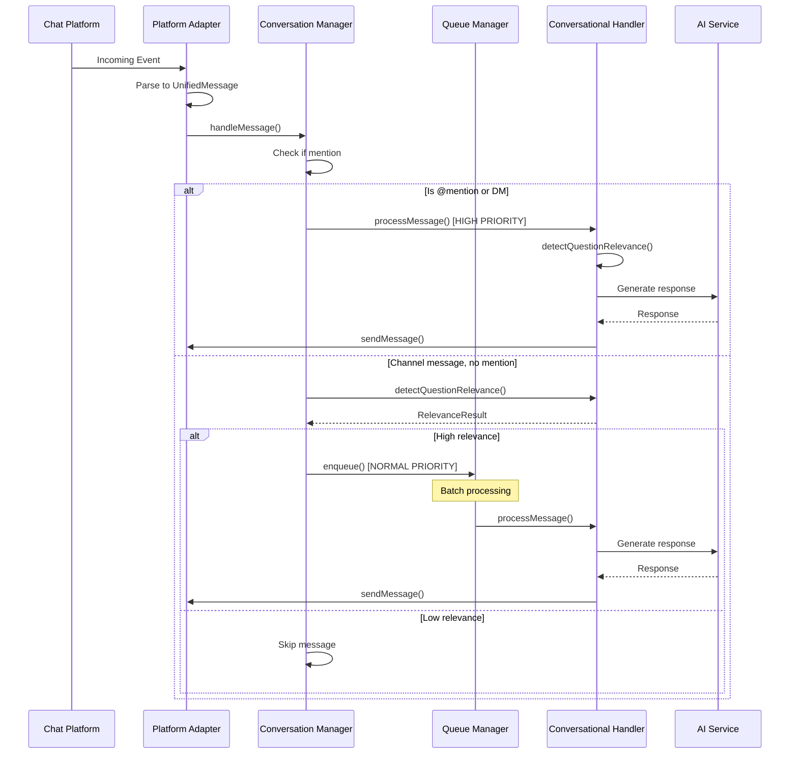

# Design Document: Chat Platform Integration

## Overview

This design document describes the architecture for intelligent event handling across chat platforms (Slack, Discord, Microsoft Teams) in the SIA platform. The system uses a platform-agnostic adapter pattern, enabling natural conversational interactions without requiring explicit @mentions for every message.

## Architecture



## Directory Structure

```
apps/api/src/services/messaging/
├── adapters/
│   ├── slack-adapter.ts       # Slack-specific implementation
│   ├── discord-adapter.ts     # Discord-specific implementation (future)
│   └── teams-adapter.ts       # Teams-specific implementation (future)
├── conversation-manager.ts    # Manages conversation state
├── conversational-handler.ts  # Processes messages, generates responses
├── message-queue-manager.ts   # Batches and prioritizes messages
├── channel-settings-manager.ts # Per-channel configuration
├── messaging-adapter.ts       # Base adapter interface
└── messaging-types.ts         # Shared type definitions
```

## Components

### 1. Messaging Adapter Interface

Platform-agnostic interface for chat platform communication.

```typescript
// apps/api/src/services/messaging/messaging-adapter.ts
interface MessagingAdapter {
  // Parse incoming platform event to unified message format
  parseIncomingMessage(event: unknown): Promise<UnifiedMessage>;

  // Send a message to a channel/thread
  sendMessage(
    channelId: string,
    text: string,
    options?: SendOptions
  ): Promise<void>;

  // Send a reply in a thread
  replyInThread(
    channelId: string,
    threadId: string,
    text: string
  ): Promise<void>;

  // Download an attachment
  downloadAttachment(attachment: Attachment): Promise<string>;

  // Unfurl a link with rich preview
  unfurlLink(
    channelId: string,
    messageTs: string,
    url: string,
    content: UnfurlContent
  ): Promise<void>;
}

interface UnifiedMessage {
  id: string;
  platform: 'slack' | 'discord' | 'teams';
  channelId: string;
  threadId?: string;
  userId: string;
  text: string;
  attachments?: Attachment[];
  metadata: Record<string, unknown>;
  timestamp: Date;
}
```

### 2. Conversation Manager

Manages conversation state and coordinates message handling.

```typescript
// apps/api/src/services/messaging/conversation-manager.ts
interface ConversationManager {
  // Handle an incoming message
  handleMessage(
    message: UnifiedMessage,
    adapter: MessagingAdapter,
    orgId: string,
    logger: Logger,
    isMention: boolean
  ): Promise<void>;

  // Get conversation state for a thread
  getConversationState(
    channelId: string,
    threadId?: string
  ): Promise<ConversationState>;

  // Check if conversation is active
  isConversationActive(channelId: string, threadId?: string): Promise<boolean>;
}

interface ConversationState {
  channelId: string;
  threadId?: string;
  isActive: boolean;
  lastActivityAt: Date;
  messageCount: number;
  participants: string[];
}
```

### 3. Conversational Handler

Processes messages and generates AI-powered responses.

```typescript
// apps/api/src/services/messaging/conversational-handler.ts
interface ConversationalHandler {
  // Process a message and generate response
  processMessage(
    message: UnifiedMessage,
    context: ConversationContext,
    orgId: string
  ): Promise<string>;

  // Detect if a message is relevant to SIA
  detectQuestionRelevance(text: string): RelevanceResult;

  // Set logger for debugging
  setLogger(logger: Logger): void;
}

interface RelevanceResult {
  confidence: 'high_related' | 'medium_related' | 'low_related' | 'unrelated';
  keywords: string[];
  isQuestion: boolean;
}
```

### 4. Message Queue Manager

Handles message batching and prioritization.

```typescript
// apps/api/src/services/messaging/message-queue-manager.ts
interface MessageQueueManager {
  // Enqueue a message for processing
  enqueue(
    message: UnifiedMessage,
    adapter: MessagingAdapter,
    orgId: string,
    priority: 'high' | 'normal',
    logger: Logger
  ): void;

  // Process queued messages
  processQueue(): Promise<void>;
}
```

### 5. Channel Settings Manager

Manages per-channel bot configuration.

```typescript
// apps/api/src/services/messaging/channel-settings-manager.ts
interface ChannelSettingsManager {
  // Get settings for a channel
  getSettings(channelId: string, orgId: string): Promise<ChannelSettings>;

  // Update channel settings
  updateSettings(
    channelId: string,
    orgId: string,
    settings: Partial<ChannelSettings>
  ): Promise<void>;
}

interface ChannelSettings {
  channelId: string;
  orgId: string;
  mode: 'mention_only' | 'active_threads' | 'always_listen';
  enabled: boolean;
}
```

## Message Processing Flow



## Relevance Detection Algorithm

```typescript
function detectQuestionRelevance(text: string): RelevanceResult {
  const keywords = [
    'job',
    'task',
    'pr',
    'pull request',
    'code',
    'build',
    'deploy',
    'status',
    'queue',
    'sia',
    'help',
  ];

  const matchedKeywords = keywords.filter(k => text.toLowerCase().includes(k));

  const isQuestion =
    text.includes('?') ||
    /^(what|how|when|where|why|can|could|would|is|are|do|does)/i.test(
      text.trim()
    );

  let confidence: RelevanceResult['confidence'];

  if (
    matchedKeywords.length >= 2 ||
    (matchedKeywords.length >= 1 && isQuestion)
  ) {
    confidence = 'high_related';
  } else if (matchedKeywords.length === 1 || isQuestion) {
    confidence = 'medium_related';
  } else if (text.length < 50) {
    confidence = 'low_related';
  } else {
    confidence = 'unrelated';
  }

  return { confidence, keywords: matchedKeywords, isQuestion };
}
```

## Platform-Specific Adapters

### Slack Adapter (Implemented)

```typescript
// apps/api/src/services/messaging/adapters/slack-adapter.ts
class SlackAdapter implements MessagingAdapter {
  constructor(private accessToken: string) {}

  async parseIncomingMessage(event: SlackEvent): Promise<UnifiedMessage> {
    return {
      id: event.ts,
      platform: 'slack',
      channelId: event.channel,
      threadId: event.thread_ts,
      userId: event.user,
      text: event.text || '',
      attachments: this.parseAttachments(event),
      metadata: { channelType: event.channel_type },
      timestamp: new Date(parseFloat(event.ts) * 1000),
    };
  }

  async sendMessage(
    channelId: string,
    text: string,
    options?: SendOptions
  ): Promise<void> {
    await fetch('https://slack.com/api/chat.postMessage', {
      method: 'POST',
      headers: {
        'Content-Type': 'application/json',
        Authorization: `Bearer ${this.accessToken}`,
      },
      body: JSON.stringify({
        channel: channelId,
        text,
        thread_ts: options?.threadId,
      }),
    });
  }
}
```

### Discord Adapter (Future)

```typescript
// apps/api/src/services/messaging/adapters/discord-adapter.ts
class DiscordAdapter implements MessagingAdapter {
  constructor(private botToken: string) {}

  async parseIncomingMessage(event: DiscordMessage): Promise<UnifiedMessage> {
    return {
      id: event.id,
      platform: 'discord',
      channelId: event.channel_id,
      threadId: event.thread?.id,
      userId: event.author.id,
      text: event.content,
      attachments: event.attachments.map(this.parseAttachment),
      metadata: { guildId: event.guild_id },
      timestamp: new Date(event.timestamp),
    };
  }

  // ... other methods
}
```

## Correctness Properties

### Property 1: Explicit Mention Always Responds

_For any_ message containing an explicit @mention of the bot, the system SHALL process it with high priority.
**Validates: Requirements 2.1, 2.4**

### Property 2: DM Always Responds

_For any_ direct message to the bot, the system SHALL respond without requiring @mention.
**Validates: Requirements 4.1, 4.2**

### Property 3: Platform Independence

_For any_ supported chat platform, the conversation logic SHALL produce equivalent behavior.
**Validates: Requirements 1.1, 1.3**

### Property 4: Relevance Filtering

_For any_ channel message without @mention, the system SHALL only respond if relevance confidence is high.
**Validates: Requirements 5.5**

### Property 5: Message Priority

_For any_ @mention message, the system SHALL process it immediately without queuing.
**Validates: Requirements 6.2**

## Error Handling

- **Platform API Errors**: Retry with exponential backoff
- **Attachment Download Failures**: Log error, continue processing
- **AI Service Errors**: Send fallback response
- **Rate Limiting**: Queue messages, respect platform limits

## Testing Strategy

- Unit tests for relevance detection
- Integration tests with mock adapters
- E2E tests with test workspaces
