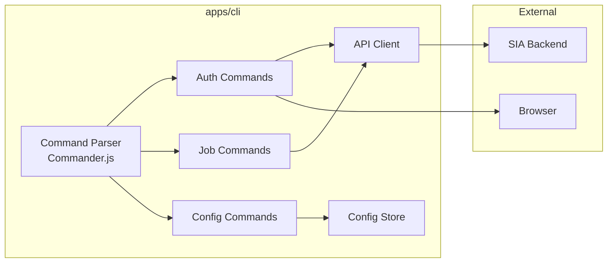

# Design Document: CLI Application

## Overview

The SIA CLI is a Node.js command-line application that allows developers to interact with the SIA platform from their terminal.

## Architecture



## Directory Structure

```
apps/cli/src/
├── commands/
│   ├── auth.ts        # Login/logout commands
│   ├── job.ts         # Job management commands
│   └── config.ts      # Configuration commands
├── lib/
│   ├── api-client.ts  # Backend API client
│   ├── config.ts      # Configuration management
│   └── auth.ts        # Token storage
└── main.ts            # Entry point
```

## Commands

| Command                        | Description               |
| ------------------------------ | ------------------------- |
| `sia login`                    | Authenticate with SIA     |
| `sia logout`                   | Remove stored credentials |
| `sia job create`               | Create a new job          |
| `sia job list`                 | List jobs                 |
| `sia job status <id>`          | Get job status            |
| `sia job logs <id>`            | Stream job logs           |
| `sia config set <key> <value>` | Set configuration         |
| `sia config get [key]`         | Get configuration         |

## Testing Strategy

- Unit tests for commands
- Integration tests with mock API
