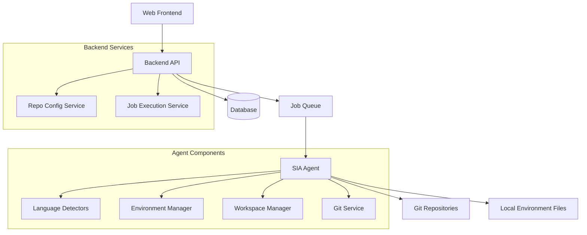

# Multi-Repo Support Design Document

## Overview

The Multi-Repo Auto-Detection & Execution System is a comprehensive feature that enables SIA to execute jobs across multiple repositories simultaneously while providing intelligent auto-detection of build and test configurations. The system is designed with security-first principles, zero-configuration user experience, and backward compatibility.

The architecture spans three main components: the backend API for configuration management, the agent infrastructure for detection and execution, and the frontend UI for multi-repository job creation. The system uses Git worktrees for efficient workspace management and stores sensitive environment variables only on agent machines.

## Architecture

The system follows a distributed architecture with clear separation of concerns:



### Data Flow

1. **Job Creation**: User selects multiple repositories in UI, frontend sends job with repos array
2. **Job Processing**: Agent processes each repository sequentially, auto-detecting configurations
3. **Configuration Storage**: Detected configurations are saved to database for future reuse
4. **Workspace Management**: Git worktrees provide isolated workspaces for each repository
5. **Environment Loading**: Secure environment variables are loaded from local agent files
6. **Execution**: Build, test, and code generation commands are executed per repository
7. **Result Aggregation**: Pull requests are created for each modified repository

## Components and Interfaces

### Backend Components

#### Repository Configuration Service

```typescript
interface RepoConfigService {
  getConfig(repoId: string): Promise<RepoConfig | null>;
  saveConfig(dto: RepoConfigDto): Promise<RepoConfig>;
  deleteConfig(repoId: string): Promise<void>;
  saveDetectedConfig(
    repoId: string,
    config: DetectedConfig
  ): Promise<RepoConfig>;
  getConfigsForRepos(repoIds: string[]): Promise<RepoConfig[]>;
  getConfigsForOrg(orgId: string): Promise<RepoConfig[]>;
}
```

#### Job Execution Service

```typescript
interface JobExecutionService {
  executeMultiRepoJob(
    jobId: string,
    repos: string[],
    prompt: string
  ): Promise<JobResult[]>;
  processRepository(
    repoId: string,
    jobContext: JobContext
  ): Promise<RepositoryResult>;
}
```

### Agent Components

#### Language Detection System

```typescript
interface LanguageDetector {
  canDetect(repoPath: string): Promise<boolean>;
  detect(repoPath: string): Promise<DetectedConfig>;
  priority: number;
}

interface DetectedConfig {
  strategy: ExecutionStrategy;
  setupCommands: string[];
  buildCommands: string[];
  testCommands: string[];
  environmentVariables: string[];
}
```

#### Environment Manager

```typescript
interface EnvironmentManager {
  loadEnvironmentVariables(
    orgId: string,
    repoId: string
  ): Promise<Record<string, string>>;
  validateRequiredVariables(
    required: string[],
    available: Record<string, string>
  ): void;
  generateSetupInstructions(
    orgId: string,
    repoId: string,
    required: string[]
  ): string;
}
```

#### Workspace Manager

```typescript
interface WorkspaceManager {
  createWorktree(repoId: string, jobId: string): Promise<string>;
  cleanupWorktree(jobId: string, repoId: string): Promise<void>;
  getWorktreePath(jobId: string, repoId: string): string;
}
```

### Frontend Components

#### Multi-Repository Job Creation Modal

```typescript
interface MultiRepoJobModal {
  repositories: Repository[];
  selectedRepos: string[];
  searchTerm: string;
  onRepoToggle: (repoId: string) => void;
  onSearchChange: (term: string) => void;
  onClearAll: () => void;
  onSubmit: (prompt: string, repos: string[]) => void;
}
```

## Data Models

### Repository Configuration

```typescript
interface RepoConfig {
  id: string;
  orgId: string;
  repoId: string;
  strategy: ExecutionStrategy;
  setupCommands: string[];
  buildCommands: string[];
  testCommands: string[];
  environmentVariables: string[];
  dockerImage?: string;
  dockerRunArgs?: string[];
  customCommands?: string[];
  isConfirmed: boolean;
  createdAt: Date;
  updatedAt: Date;
}

enum ExecutionStrategy {
  AUTO = 'auto',
  DEVCONTAINER = 'devcontainer',
  DOCKER_COMPOSE = 'docker-compose',
  CUSTOM = 'custom',
}
```

### Job Models

```typescript
interface MultiRepoJob {
  id: string;
  orgId: string;
  prompt: string;
  repos: string[]; // Array of repository IDs
  status: JobStatus;
  results: RepositoryResult[];
  createdAt: Date;
  updatedAt: Date;
}

interface RepositoryResult {
  repoId: string;
  status: 'success' | 'failed' | 'pending';
  pullRequestUrl?: string;
  errorMessage?: string;
  executionLog: string[];
}
```

### Detection Models

```typescript
interface DetectionResult {
  repoId: string;
  detected: boolean;
  config?: DetectedConfig;
  error?: AutoDetectionError;
}

class AutoDetectionError extends Error {
  constructor(
    public repoId: string,
    public reason: string,
    public suggestions: string[]
  ) {
    super(`Auto-detection failed for ${repoId}: ${reason}`);
  }
}
```

## Error Handling

### Auto-Detection Failures

When auto-detection fails, the system provides clear error messages with actionable steps:

```typescript
interface DetectionError {
  type: 'NO_CONFIG_FOUND' | 'INVALID_CONFIG' | 'MISSING_DEPENDENCIES';
  message: string;
  suggestions: string[];
  configurationUrl: string;
}
```

### Environment Variable Errors

Missing environment variables trigger specific error types with setup instructions:

```typescript
class MissingEnvFileError extends Error {
  constructor(
    public orgId: string,
    public repoId: string,
    public requiredVars: string[]
  ) {
    super(`Environment file missing for ${orgId}/${repoId}`);
  }

  getSetupInstructions(): string {
    return `Create file: ~/.sia/env/${this.orgId}/${this.repoId}/.env`;
  }
}
```

### Job Execution Errors

Repository-level failures don't stop the entire job:

```typescript
interface ExecutionError {
  repoId: string;
  phase: 'setup' | 'build' | 'test' | 'codegen';
  command: string;
  exitCode: number;
  stderr: string;
  stdout: string;
}
```

## Testing Strategy

The multi-repo support system requires comprehensive testing across multiple layers:

### Unit Testing

- Repository configuration service operations (CRUD)
- Language detector implementations for each supported language
- Environment manager file operations and validation
- Workspace manager Git worktree operations
- Frontend component interactions and state management

### Property-Based Testing

Property-based testing will verify universal properties using **fast-check** for TypeScript:

- Configuration round-trip properties for serialization/deserialization
- Repository selection invariants in the UI
- Git worktree isolation properties
- Environment variable security properties
- Multi-repository job execution consistency

Each property-based test will run a minimum of 100 iterations to ensure comprehensive coverage of the input space.

## Correctness Properties

_A property is a characteristic or behavior that should hold true across all valid executions of a system-essentially, a formal statement about what the system should do. Properties serve as the bridge between human-readable specifications and machine-verifiable correctness guarantees._

### Property 1: Multi-repository selection completeness

_For any_ set of repositories and selection state, the job creation interface should allow selection of zero, one, or multiple repositories and execute jobs across all selected repositories
**Validates: Requirements 1.1, 1.2**

### Property 2: Pull request generation consistency

_For any_ multi-repository job that modifies repositories, the number of pull requests created should equal the number of repositories that were actually modified
**Validates: Requirements 1.3**

### Property 3: Error isolation in multi-repository jobs

_For any_ multi-repository job where some repositories fail, the system should continue processing all remaining repositories and report results for each repository independently
**Validates: Requirements 1.4**

### Property 4: Repository result completeness

_For any_ completed multi-repository job, the display should include status and pull request information for each repository that was processed
**Validates: Requirements 1.5**

### Property 5: Auto-detection strategy consistency

_For any_ repository processed for the first time, the auto-detection system should determine exactly one execution strategy based on the repository's file structure
**Validates: Requirements 2.1**

### Property 6: Node.js configuration extraction accuracy

_For any_ valid package.json file, the Node.js detector should correctly extract build and test scripts and identify the package manager from corresponding lock files
**Validates: Requirements 2.2**

### Property 7: Python configuration detection completeness

_For any_ Python project with pyproject.toml or requirements.txt, the Python detector should generate appropriate build and test commands
**Validates: Requirements 2.3**

### Property 8: DevContainer configuration parsing correctness

_For any_ valid devcontainer.json file, the DevContainer detector should correctly extract the container image and run arguments
**Validates: Requirements 2.4**

### Property 9: Configuration persistence round-trip

_For any_ successfully detected repository configuration, saving and then retrieving the configuration should yield an equivalent configuration object
**Validates: Requirements 2.5**

### Property 10: Auto-detection failure handling

_For any_ repository where auto-detection fails, the system should generate clear error messages with actionable configuration instructions
**Validates: Requirements 2.6**

### Property 11: Environment variable storage security

_For any_ repository requiring environment variables, variable values should never be stored in the database and should only exist in local agent files
**Validates: Requirements 3.1, 3.2**

### Property 12: Environment variable validation completeness

_For any_ job requiring environment variables, all required variables must be validated as present before job execution begins
**Validates: Requirements 3.3, 3.4**

### Property 13: Environment file security permissions

_For any_ created environment variable file, the file permissions should be set to restrict access to the file owner only
**Validates: Requirements 3.5**

### Property 14: Custom configuration precedence

_For any_ repository with both auto-detected and custom configurations, the custom configuration should always take precedence in job execution
**Validates: Requirements 4.1, 4.2**

### Property 15: Configuration validation integrity

_For any_ repository configuration update, invalid configurations should be rejected before being saved to the database
**Validates: Requirements 4.3**

### Property 16: Execution strategy enumeration completeness

_For any_ repository configuration interface, all four execution strategies (auto, devcontainer, docker-compose, custom) should be available as options
**Validates: Requirements 4.4**

### Property 17: Command injection prevention

_For any_ custom commands specified in repository configuration, commands should be stored as arrays rather than strings to prevent shell injection
**Validates: Requirements 4.5**

### Property 18: Git worktree isolation

_For any_ multi-repository job, each repository should receive its own isolated Git worktree that doesn't interfere with other repositories
**Validates: Requirements 5.1, 5.4**

### Property 19: Bare repository sharing efficiency

_For any_ Git worktree creation, worktrees should link to shared bare repositories to minimize disk usage while maintaining isolation
**Validates: Requirements 5.2, 5.5**

### Property 20: Workspace cleanup completeness

_For any_ job that creates Git worktrees, all worktrees should be cleaned up when the job completes or fails
**Validates: Requirements 5.3**

### Property 21: API endpoint functionality completeness

_For any_ repository configuration operation, appropriate GET, POST, and DELETE endpoints should handle the operation with proper authentication
**Validates: Requirements 6.1, 6.2, 6.3, 6.4**

### Property 22: API error response informativeness

_For any_ API error condition, the error response should contain comprehensive and actionable error messages
**Validates: Requirements 6.5**

### Property 23: Repository search filtering accuracy

_For any_ search term in the repository selection interface, the filtered results should include only repositories whose names contain the search term
**Validates: Requirements 7.2**

### Property 24: Repository selection state consistency

_For any_ repository selection state, the displayed count should match the number of selected repositories, and clear all should deselect all repositories
**Validates: Requirements 7.3**

### Property 25: Success message accuracy

_For any_ successfully created multi-repository job, the success message should display the exact number of repositories included in the job
**Validates: Requirements 7.5**

### Property 26: Backward compatibility preservation

_For any_ existing single-repository job format, the system should process it correctly alongside new multi-repository formats
**Validates: Requirements 8.1, 8.2, 8.3, 8.5**

### Property 27: Data migration integrity

_For any_ existing job record during system migration, all job data and repository associations should be preserved without loss
**Validates: Requirements 8.4**

## Error Handling

The system implements comprehensive error handling at multiple levels:

### Detection Level Errors

- **AutoDetectionError**: Thrown when no suitable detector can process a repository
- **ConfigurationValidationError**: Thrown when repository configurations fail validation
- **LanguageDetectionError**: Thrown when language-specific detection fails

### Environment Level Errors

- **MissingEnvFileError**: Thrown when required environment files don't exist
- **MissingEnvKeysError**: Thrown when required environment variables are missing
- **EnvironmentPermissionError**: Thrown when environment files have incorrect permissions

### Execution Level Errors

- **WorktreeCreationError**: Thrown when Git worktree creation fails
- **RepositoryExecutionError**: Thrown when repository-specific execution fails
- **WorkspaceCleanupError**: Thrown when worktree cleanup fails

### API Level Errors

- **AuthenticationError**: Thrown when API requests lack proper authentication
- **AuthorizationError**: Thrown when users lack permission for repository operations
- **ValidationError**: Thrown when API request data fails validation

All errors include:

- Clear error messages describing what went wrong
- Actionable suggestions for resolution
- Relevant context (repository ID, organization ID, etc.)
- Links to configuration interfaces when applicable

## Testing Strategy

### Unit Testing Approach

Unit tests will focus on individual component functionality:

- **Repository Configuration Service**: Test CRUD operations, validation logic, and error handling
- **Language Detectors**: Test detection logic for each supported language/framework
- **Environment Manager**: Test file operations, validation, and security measures
- **Workspace Manager**: Test Git worktree operations and cleanup
- **API Endpoints**: Test request/response handling, authentication, and error cases
- **Frontend Components**: Test user interactions, state management, and display logic

### Property-Based Testing Approach

Property-based tests will use **fast-check** to verify universal properties:

- **Configuration Round-Trip Properties**: Ensure serialization/deserialization preserves data integrity
- **Repository Selection Invariants**: Verify selection logic works across all possible repository sets
- **Git Worktree Isolation Properties**: Ensure worktrees remain isolated across concurrent operations
- **Environment Variable Security Properties**: Verify sensitive data never leaks to inappropriate storage
- **Multi-Repository Execution Consistency**: Ensure job execution behaves consistently regardless of repository count
- **Error Handling Completeness**: Verify all error conditions produce appropriate error messages
- **Backward Compatibility Properties**: Ensure legacy formats continue to work correctly

Each property-based test will be configured to run a minimum of 100 iterations to ensure comprehensive coverage of the input space. Tests will be tagged with comments explicitly referencing the correctness property they implement using the format: **Feature: multi-repo-support, Property {number}: {property_text}**
