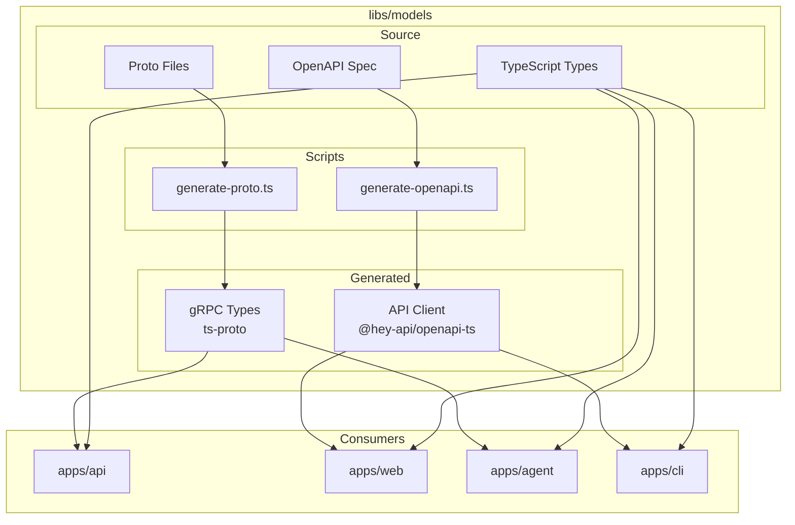

# Design Document: Shared Models Library

## Overview

The Shared Models Library provides type definitions, protobuf schemas, and generated clients used across all SIA applications. It ensures type safety and consistency across the monorepo.

## Architecture



## Directory Structure

```
libs/models/
├── src/
│   ├── proto/
│   │   ├── agent.proto        # Agent service definition
│   │   └── generated/         # Generated TypeScript
│   ├── openapi/
│   │   └── generated/         # Generated API client
│   └── types/
│       ├── job.ts             # Job types
│       ├── agent.ts           # Agent types
│       └── index.ts           # Barrel export
├── scripts/
│   ├── generate-proto.ts      # Proto generation script
│   └── generate-openapi.ts    # OpenAPI generation script
├── package.json
└── tsconfig.json
```

## Proto Service Definition

```protobuf
service AgentService {
  rpc ExecuteJob(ExecuteJobRequest) returns (stream LogMessage);
  rpc CancelJob(CancelJobRequest) returns (CancelJobResponse);
  rpc RunVerification(VerificationRequest) returns (VerificationResponse);
  rpc CreatePR(CreatePRRequest) returns (CreatePRResponse);
  rpc CleanupWorkspace(CleanupRequest) returns (CleanupResponse);
  rpc HintJob(HintJobRequest) returns (HintJobResponse);
}
```

## Generation Scripts

### Proto Generation
```bash
npm run generate:proto
# Uses ts-proto to generate TypeScript from .proto files
```

### OpenAPI Generation
```bash
npm run generate:openapi
# Uses @hey-api/openapi-ts to generate client from OpenAPI spec
```

## Testing Strategy

- Type checking via TypeScript compiler
- Ensure generated code compiles without errors
