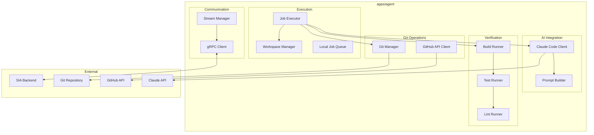
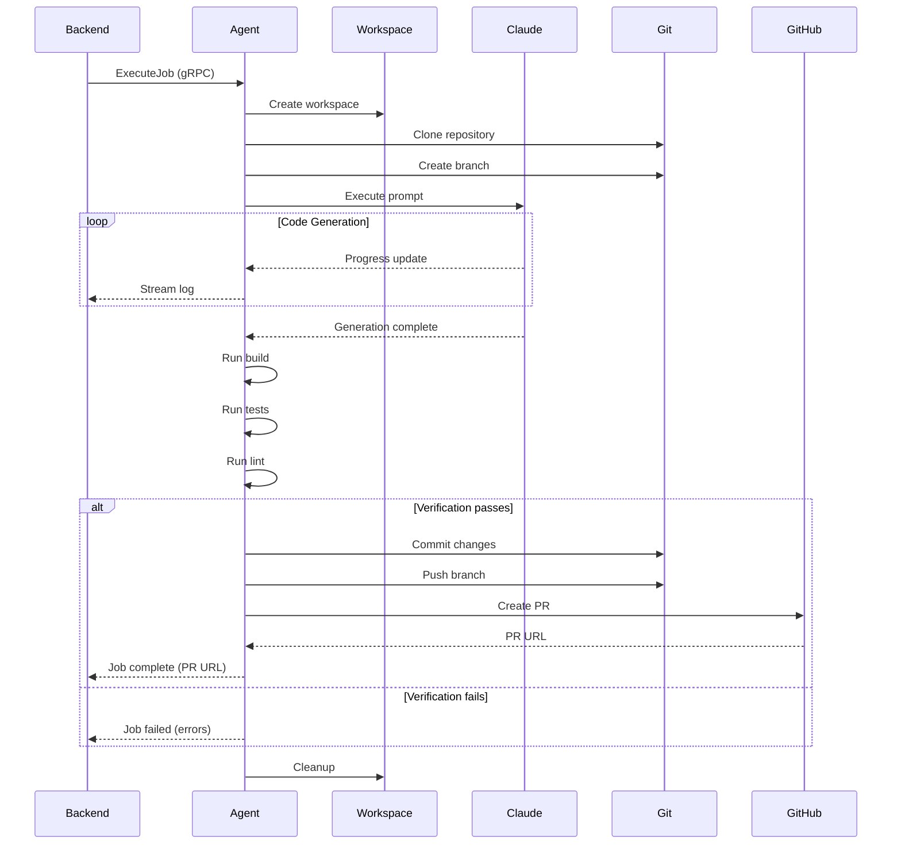

# Design Document: SIA Agent

## Overview

The SIA Agent is a Node.js application that runs on Cloud Dev Machines. It receives coding tasks from the backend, executes them using AI coding assistants, verifies the generated code, and creates Pull Requests.

## Architecture



## Directory Structure

```
apps/agent/src/
├── grpc/
│   ├── client.ts          # gRPC client
│   └── stream-manager.ts  # Stream handling
├── execution/
│   ├── executor.ts        # Job execution orchestration
│   ├── workspace.ts       # Workspace management
│   └── queue.ts           # Local job queue
├── ai/
│   ├── claude-client.ts   # Claude Code integration
│   └── prompt-builder.ts  # Prompt construction
├── git/
│   ├── git-manager.ts     # Git operations
│   └── github-client.ts   # GitHub API
├── verification/
│   ├── build-runner.ts    # Build execution
│   ├── test-runner.ts     # Test execution
│   └── lint-runner.ts     # Lint execution
├── config/
│   └── index.ts           # Configuration
└── main.ts                # Entry point
```

## Job Execution Flow



## Components

### gRPC Client
- Maintains connection to backend
- Handles reconnection with exponential backoff
- Manages bidirectional streaming

### Workspace Manager
- Creates isolated directories for each job
- Handles cleanup after job completion
- Manages concurrent workspaces

### Claude Code Client
- Invokes Claude Code CLI or API
- Streams output to backend
- Handles timeouts and errors

### Git Manager
- Clones repositories with credentials
- Creates and switches branches
- Commits and pushes changes

### Verification Pipeline
- Runs build commands (npm run build, etc.)
- Runs test commands (npm test, etc.)
- Runs lint commands (npm run lint, etc.)
- Captures and reports errors

## Correctness Properties

### Property 1: Workspace Isolation
*For any* two concurrent jobs, each job SHALL have its own isolated workspace directory.
**Validates: Requirements 2.1**

### Property 2: Cleanup Guarantee
*For any* job completion (success or failure), the workspace SHALL be cleaned up.
**Validates: Requirements 2.3**

### Property 3: Log Streaming
*For any* output from Claude Code, the agent SHALL stream it to the backend within 1 second.
**Validates: Requirements 1.4**

### Property 4: Health Check Response
*For any* health check request, the agent SHALL respond within 5 seconds.
**Validates: Requirements 6.1**

## Error Handling

- **Connection Errors**: Retry with exponential backoff
- **Clone Errors**: Report and fail job
- **AI Errors**: Report and fail job
- **Verification Errors**: Report details and fail job
- **PR Creation Errors**: Report and fail job

## Testing Strategy

- Unit tests for each component
- Integration tests with mock backend
- E2E tests with real repositories
