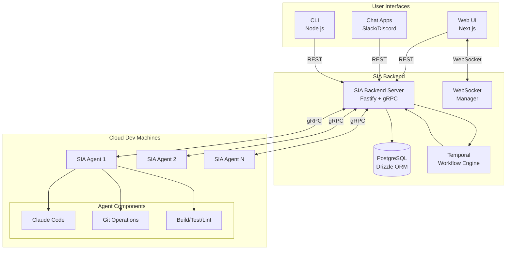
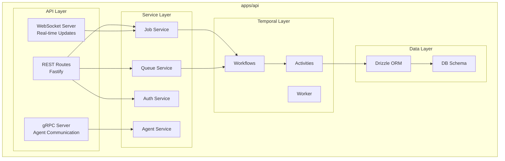
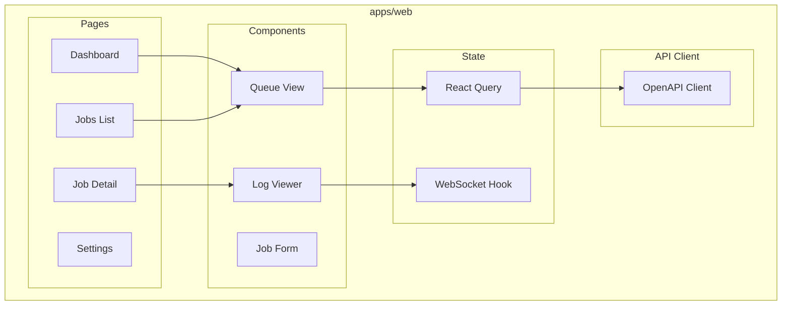
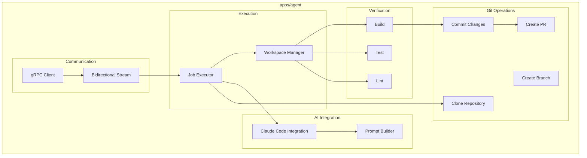
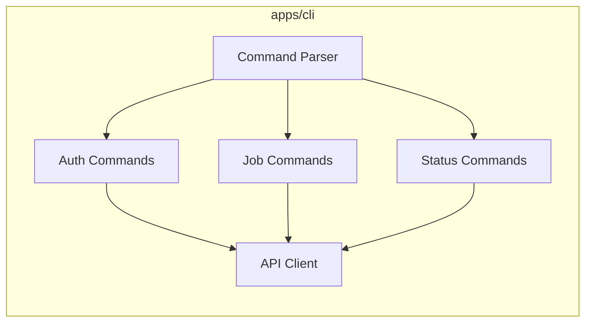
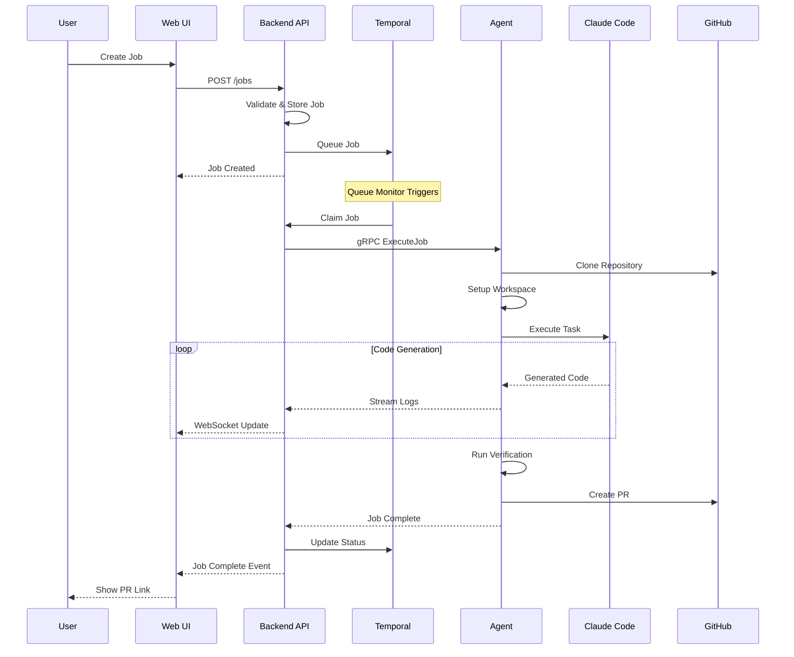

# Design Document: SIA Platform

## Overview

SIA (Software Intelligence Assistant) is a distributed platform for automating coding tasks using AI. The platform enables users to submit coding tasks via Web UI or Chat Apps, which are then executed by AI-powered agents running on Cloud Dev Machines. The system creates ready-to-review Pull Requests automatically.

The architecture follows a hub-and-spoke model:
- **Hub**: SIA Backend Server (Fastify API) orchestrates all operations
- **Spokes**: Multiple SIA Agents execute tasks on Cloud Dev Machines
- **Clients**: Web UI, CLI, and Chat Apps provide user interfaces

## High-Level Architecture



## Monorepo Structure

```
sia/
├── apps/
│   ├── api/              # Backend API Server (Fastify)
│   ├── web/              # Web Frontend (Next.js)
│   ├── agent/            # SIA Agent (Node.js + gRPC)
│   ├── cli/              # Command Line Interface
│   └── landing-page/     # Marketing Landing Page (Vite)
├── libs/
│   └── models/           # Shared Types, Protobuf, OpenAPI
├── .kiro/
│   └── specs/            # Feature Specifications
├── nx.json               # Nx Configuration
├── package.json          # Root Package
└── tsconfig.base.json    # Shared TypeScript Config
```

## Component Architecture

### 1. Backend API Server (`apps/api`)

The central hub that coordinates all platform operations.



**Key Technologies:**
- Fastify for REST API
- gRPC for agent communication
- WebSocket for real-time updates
- Temporal for workflow orchestration
- Drizzle ORM for database access
- PropelAuth for authentication

### 2. Web Frontend (`apps/web`)

Next.js application providing the user interface.



**Key Technologies:**
- Next.js 15 with App Router
- React 19
- TailwindCSS + shadcn/ui
- React Query for data fetching
- WebSocket for real-time updates

### 3. SIA Agent (`apps/agent`)

Executes coding tasks on Cloud Dev Machines.



**Key Technologies:**
- Node.js with TypeScript
- gRPC for backend communication
- Claude Code SDK for AI coding
- Simple-git for Git operations

### 4. CLI Application (`apps/cli`)

Command-line interface for developers.



**Key Technologies:**
- Node.js with TypeScript
- Commander.js for CLI parsing
- OpenAPI client for API calls

### 5. Shared Models Library (`libs/models`)

Shared type definitions and generated code.

```
libs/models/
├── src/
│   ├── proto/           # Protobuf definitions
│   │   └── generated/   # Generated gRPC types
│   ├── openapi/         # OpenAPI schema
│   │   └── generated/   # Generated API client
│   └── types/           # Shared TypeScript types
├── scripts/
│   ├── generate-proto.ts
│   └── generate-openapi.ts
└── package.json
```

## Data Flow

### Job Execution Flow



## Technology Stack Summary

| Component | Technology | Purpose |
|-----------|------------|---------|
| Monorepo | Nx | Build orchestration, caching, dependency management |
| Backend | Fastify | REST API server |
| Frontend | Next.js 15 | Web application |
| Database | PostgreSQL | Data persistence |
| ORM | Drizzle | Type-safe database access |
| Workflows | Temporal | Durable task orchestration |
| Agent Comm | gRPC | Backend-agent communication |
| Real-time | WebSocket | Live updates to clients |
| Auth | PropelAuth | User authentication |
| AI | Claude Code | Code generation |
| Styling | TailwindCSS | UI styling |
| Components | shadcn/ui | UI component library |

## Correctness Properties

*A property is a characteristic or behavior that should hold true across all valid executions of a system.*

### Property 1: Job State Consistency
*For any* job in the system, the job status SHALL be one of: draft, queued, in-progress, in-review, completed, failed.
**Validates: Requirements 2.4, 7.1**

### Property 2: Queue Order Preservation
*For any* set of jobs in a queue, jobs SHALL be processed in ascending orderInQueue order.
**Validates: Requirements 7.2**

### Property 3: Agent Assignment Exclusivity
*For any* agent at any point in time, the agent SHALL have at most one job in-progress.
**Validates: Requirements 7.3**

### Property 4: Real-time Update Delivery
*For any* job status change or log message, all subscribed WebSocket clients SHALL receive the update.
**Validates: Requirements 8.1, 8.2**

### Property 5: Authentication Enforcement
*For any* API request to protected endpoints, the system SHALL verify authentication before processing.
**Validates: Requirements 9.1, 9.2**

## Error Handling

### Error Categories

1. **User Errors**: Invalid input, unauthorized access
2. **System Errors**: Database failures, service unavailability
3. **Agent Errors**: Build failures, verification failures, AI errors
4. **Network Errors**: gRPC disconnection, WebSocket drops

### Recovery Strategies

- **Temporal Retries**: Automatic retry with exponential backoff
- **Orphan Detection**: Periodic checks for stuck jobs
- **Agent Health Checks**: Continuous monitoring of agent availability
- **Graceful Degradation**: Continue operation with reduced functionality

## Testing Strategy

### Unit Tests
- Service layer logic
- Utility functions
- Component rendering

### Integration Tests
- API endpoint testing
- Database operations
- gRPC communication

### End-to-End Tests
- Full job execution flow
- User authentication flow
- Real-time update delivery

### Property-Based Tests
- Queue ordering properties
- State machine transitions
- Data validation
