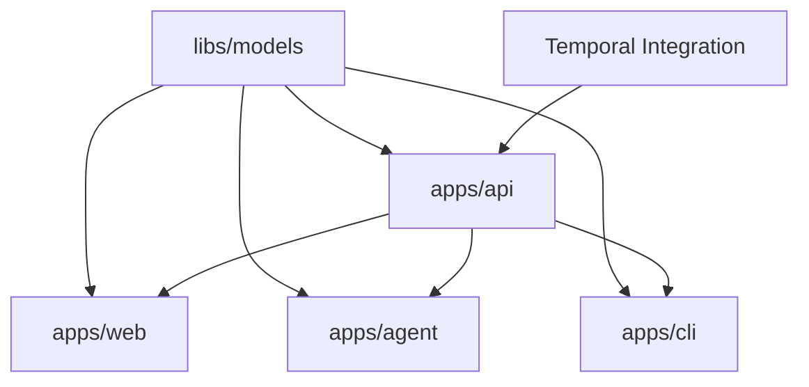

# Implementation Plan

This is the high-level implementation plan for the SIA platform. Each major component has its own detailed spec in a separate directory.

## Project Structure

- **`apps/api`** - Backend API Server → See `.kiro/specs/api-server/`
- **`apps/web`** - Web Frontend → See `.kiro/specs/web-frontend/`
- **`apps/agent`** - SIA Agent → See `.kiro/specs/sia-agent/`
- **`apps/cli`** - CLI Application → See `.kiro/specs/cli-app/`
- **`apps/landing-page`** - Landing Page → See `.kiro/specs/landing-page/`
- **`libs/models`** - Shared Models → See `.kiro/specs/shared-models/`

## High-Level Tasks

- [x] 1. Monorepo Setup and Configuration
  - [x] 1.1 Initialize Nx workspace with npm workspaces
    - Configure nx.json with plugins for Next.js, Jest, ESLint, Vite
    - Set up shared TypeScript configuration
    - _Requirements: 1.1, 1.2_
  - [x] 1.2 Configure build caching and dependency management
    - Set up namedInputs for production builds
    - Configure target defaults for test dependencies
    - _Requirements: 1.3, 1.4_

- [x] 2. Shared Models Library (`libs/models`)
  - [x] 2.1 Set up protobuf definitions for gRPC
    - Define agent service proto files
    - Configure ts-proto for TypeScript generation
    - _Requirements: 6.2_
  - [x] 2.2 Set up OpenAPI schema and client generation
    - Configure @hey-api/openapi-ts for client generation
    - _Requirements: 6.3_
  - [x] 2.3 Define shared TypeScript interfaces
    - Job, Agent, Organization, User types
    - _Requirements: 6.1_

- [x] 3. Backend API Server (`apps/api`)
  - [x] 3.1 Set up Fastify server with REST routes
    - Configure CORS, authentication middleware
    - Implement job, queue, organization routes
    - _Requirements: 2.1, 2.4_
  - [x] 3.2 Implement gRPC server for agent communication
    - Agent registration and heartbeat
    - Job execution streaming
    - _Requirements: 2.2_
  - [x] 3.3 Set up PostgreSQL with Drizzle ORM
    - Define database schema
    - Configure migrations
    - _Requirements: 10.1, 10.2, 10.3_
  - [x] 3.4 Implement WebSocket server for real-time updates
    - Job log streaming
    - Status change notifications
    - _Requirements: 2.5, 8.1, 8.2_
  - [x] 3.5 Integrate PropelAuth for authentication
    - User authentication middleware
    - Organization membership validation
    - _Requirements: 2.3, 9.1, 9.2_
  - [x] 3.6 Implement Temporal integration
    - See `.kiro/specs/temporal-task-queue/` for detailed tasks
    - _Requirements: 7.1, 7.2, 7.3_

- [x] 4. Web Frontend (`apps/web`)
  - [x] 4.1 Set up Next.js application with App Router
    - Configure TailwindCSS and shadcn/ui
    - Set up authentication with PropelAuth
    - _Requirements: 3.1_
  - [x] 4.2 Implement dashboard and job management pages
    - Job list with filtering and sorting
    - Job creation form
    - _Requirements: 3.1, 3.2_
  - [x] 4.3 Implement real-time log viewer
    - WebSocket connection for live logs
    - Log filtering and search
    - _Requirements: 3.3_
  - [x] 4.4 Implement job completion and PR display
    - PR link display
    - Execution summary
    - _Requirements: 3.4_

- [x] 5. SIA Agent (`apps/agent`)
  - [x] 5.1 Set up gRPC client for backend communication
    - Connection management
    - Bidirectional streaming
    - _Requirements: 4.1_
  - [x] 5.2 Implement workspace management
    - Repository cloning
    - Branch creation
    - _Requirements: 4.2_
  - [x] 5.3 Integrate AI coding assistant
    - Claude Code integration
    - Prompt building
    - _Requirements: 4.3_
  - [x] 5.4 Implement verification pipeline
    - Build, test, lint execution
    - Error reporting
    - _Requirements: 4.4_
  - [x] 5.5 Implement PR creation
    - Git commit and push
    - GitHub PR creation
    - _Requirements: 4.5_

- [ ] 6. CLI Application (`apps/cli`)
  - [ ] 6.1 Set up CLI framework
    - Command parsing with Commander.js
    - Configuration management
    - _Requirements: 5.1_
  - [ ] 6.2 Implement authentication commands
    - Login/logout
    - Token management
    - _Requirements: 5.1_
  - [ ] 6.3 Implement job commands
    - Create job
    - List jobs
    - Get job status
    - _Requirements: 5.2, 5.3_

- [x] 7. Landing Page (`apps/landing-page`)
  - [x] 7.1 Set up Vite application
    - Configure TailwindCSS
    - _Requirements: 11.1_
  - [x] 7.2 Implement marketing content
    - Product features
    - Call-to-action
    - _Requirements: 11.1, 11.2_

- [ ] 8. Chat App Integration
  - [ ] 8.1 Implement Slack integration
    - Slash commands
    - Job notifications
    - _Requirements: 12.1, 12.2_
  - [ ] 8.2 Implement Discord integration
    - Bot commands
    - Job notifications
    - _Requirements: 12.1, 12.2_

- [ ] 9. Final Integration and Testing
  - [ ] 9.1 End-to-end testing
    - Full job execution flow
    - Multi-agent scenarios
  - [ ] 9.2 Performance testing
    - Load testing
    - Concurrent job handling
  - [ ] 9.3 Documentation
    - API documentation
    - Deployment guides

## Component-Specific Specs

Each major component has detailed specifications in separate directories:

| Component | Spec Location | Status |
|-----------|---------------|--------|
| Temporal Task Queue | `.kiro/specs/temporal-task-queue/` | ✅ Complete |
| API Server | `.kiro/specs/api-server/` | 📋 To Create |
| Web Frontend | `.kiro/specs/web-frontend/` | 📋 To Create |
| SIA Agent | `.kiro/specs/sia-agent/` | 📋 To Create |
| CLI App | `.kiro/specs/cli-app/` | 📋 To Create |
| Shared Models | `.kiro/specs/shared-models/` | 📋 To Create |

## Dependency Graph

## Notes

- Tasks marked with [x] indicate completed implementation
- Tasks marked with [ ] indicate pending implementation
- Each component spec contains detailed sub-tasks and acceptance criteria
- Property-based tests are marked with * and are optional for MVP
