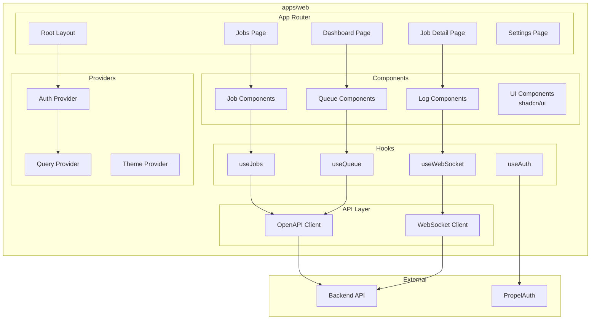

# Design Document: Web Frontend

## Overview

The SIA Web Frontend is a Next.js 15 application using the App Router. It provides the primary user interface for job management, real-time monitoring, and queue management.

## Architecture



## Directory Structure

```
apps/web/
├── app/                    # Next.js App Router
│   ├── layout.tsx         # Root layout
│   ├── page.tsx           # Dashboard
│   ├── jobs/
│   │   ├── page.tsx       # Jobs list
│   │   └── [id]/
│   │       └── page.tsx   # Job detail
│   ├── queues/
│   │   └── page.tsx       # Queue management
│   └── settings/
│       └── page.tsx       # Settings
├── components/
│   ├── ui/                # shadcn/ui components
│   ├── jobs/              # Job-related components
│   ├── queues/            # Queue components
│   └── logs/              # Log viewer components
├── hooks/
│   ├── use-jobs.ts
│   ├── use-queue.ts
│   └── use-websocket.ts
├── providers/
│   ├── auth-provider.tsx
│   └── query-provider.tsx
├── lib/
│   ├── api-client.ts      # OpenAPI client wrapper
│   └── websocket.ts       # WebSocket client
└── types/
    └── index.ts           # TypeScript types
```

## Key Components

### Job Detail Modal

- Displays job information
- Real-time log streaming
- PR link when complete
- Cancel/retry actions

### Queue View

- Drag-and-drop reordering
- Pause/resume controls
- Job status indicators

### Log Viewer

- Auto-scrolling log display
- Level filtering (info, warn, error)
- Stage filtering
- Search functionality

## State Management

- **React Query**: Server state (jobs, queues, agents)
- **WebSocket**: Real-time updates (logs, status changes)
- **PropelAuth**: Authentication state

## Correctness Properties

### Property 1: Authentication Guard

_For any_ protected route, the system SHALL redirect unauthenticated users to login.
**Validates: Requirements 5.1**

### Property 2: Real-time Log Delivery

_For any_ log message from the backend, the log viewer SHALL display it within 100ms.
**Validates: Requirements 3.1**

### Property 3: Queue Order Consistency

_For any_ queue display, jobs SHALL be shown in the same order as the backend queue.
**Validates: Requirements 4.1**

## Testing Strategy

- Component tests with React Testing Library
- E2E tests with Playwright
- Visual regression tests
