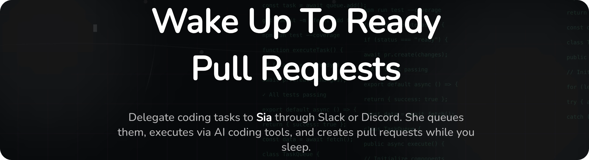

# <a alt="Sia logo" href="https://getpullrequest.com" target="_blank" rel="noreferrer"></a> Sia

<div align="center" style="margin-bottom: 2rem;">
  
</div>

<div align="center" style="margin-bottom: 2rem;">
  
</div>
<br/>

<p align="center">
  <strong>Wake up to ready pull requests</strong>
</p>

<p align="center">
  <a href="#quick-start">Quick Start</a> •
  <a href="#features">Features</a> •
  <a href="#how-it-works">How It Works</a> •
  <a href="./CONTRIBUTING.md">Contributing</a> •
  <a href="https://getpullrequest.com">Website</a>
</p>

<p align="center">
  
</p>

---

## Overview

**Sia is an AI coding assistant that handles small coding tasks while you sleep.** Give it a task before you log off, and wake up to a pull request ready for review.

Queue tasks from Slack or Discord. Sia writes the code, runs tests, fixes issues, and opens a PR—all automatically. Review and merge from your phone.

> ⚠️ **Pre-alpha**: Still in active development, not ready for production yet.

## Why Sia?

### Ship Code While You Sleep

Traditional AI coding assistants require you to be at your computer, actively guiding them. Sia is different—it works asynchronously. Queue up small tasks before you clock out, and wake up to ready pull requests.

### Works Where You Already Are

No new tools to learn. Sia lives in Slack and Discord. Just `@mention` it with a task, and it handles the rest. Review and merge PRs from your phone during your morning commute.

### Autonomous Task Execution

Sia doesn't just write code—it runs tests, fixes failures, iterates on issues, and opens polished PRs. You get to review finished work, not babysit an AI through each step.

## Features

| Feature                    | Description                                                                 |
| -------------------------- | --------------------------------------------------------------------------- |
| **Chat-Native Interface**  | Works directly in Slack and Discord—no context switching                    |
| **Automatic PRs**          | Writes code, runs tests, fixes issues, and opens pull requests autonomously |
| **24/7 Operation**         | Queue tasks anytime, get results when you're ready                          |
| **Mobile-Friendly**        | Review and merge PRs from your phone—no laptop required                     |
| **Smart Queue Management** | Prioritize, pause, or cancel tasks right from chat                          |
| **Learning System**        | Adapts to your codebase patterns and preferences over time                  |

## How It Works

1. **Request a task** — Mention `@sia` in Slack or Discord with what you need
2. **Task gets queued** — Sia acknowledges and adds it to the queue
3. **AI agents execute** — Autonomous agents write code, run tests, and fix issues
4. **PR created** — You receive a pull request ready for review
5. **Review and merge** — Approve from your phone or desktop

### Architecture Overview

Sia uses a distributed architecture designed for autonomous operation:

- **Chat Integrations** — Slack and Discord bots for task submission
- **Web Dashboard** — Monitor queue, view logs, manage tasks
- **Backend Server** — Orchestrates jobs and coordinates AI agents
- **AI Agents** — Run on cloud dev machines, execute tasks autonomously
- **gRPC Communication** — Real-time coordination between backend and agents

For detailed architecture documentation, see [`.kiro/specs/`](./.kiro/specs/).

## Quick Start

### Using Docker Compose (Recommended)

Get Sia running locally in minutes:

```sh
# Clone the repository
git clone https://github.com/your-org/sia.git
cd sia

# Copy and configure environment files
cp apps/api/.env.example apps/api/.env
cp apps/web/.env.local.example apps/web/.env.local

# Edit the .env files with your API keys and configuration
# Then start everything
docker-compose -f docker-compose.dev.yml up
```

This starts:

- PostgreSQL database (port 5432)
- API server (port 3001)
- Web UI (port 3000)

**For detailed setup instructions**, including local development without Docker, configuration guides, and troubleshooting, see **[CONTRIBUTING.md](./CONTRIBUTING.md#development-setup)**.

## Documentation

| Document                                 | Description                                                      |
| ---------------------------------------- | ---------------------------------------------------------------- |
| **[CONTRIBUTING.md](./CONTRIBUTING.md)** | Development setup, contribution guidelines, and coding standards |
| **[DOCKER_SETUP.md](./DOCKER_SETUP.md)** | Detailed Docker Compose setup and configuration guide            |
| **[CHANGELOG.md](./CHANGELOG.md)**       | Version history and release notes                                |
| **[AGENTS.md](./AGENTS.md)**             | Guide for AI agents working with this codebase                   |
| **[`.kiro/specs/`](./.kiro/specs/)**     | Architecture specifications and design documentation             |

## Tech Stack

Built with modern, proven technologies:

| Layer         | Technology                                      |
| ------------- | ----------------------------------------------- |
| **Monorepo**  | Nx                                              |
| **Frontend**  | Next.js, TailwindCSS, shadcn/ui, TanStack Query |
| **Backend**   | Fastify (REST), WebSocket (logs), gRPC (agents) |
| **Database**  | PostgreSQL + Drizzle ORM                        |
| **Workflows** | Temporal                                        |
| **Auth**      | PropelAuth                                      |

## Contributing

We welcome contributions! Whether it's:

- 🐛 Bug reports and fixes
- ✨ New features and enhancements
- 📖 Documentation improvements
- 💡 Ideas and suggestions

Please read [CONTRIBUTING.md](./CONTRIBUTING.md) for guidelines on:

- Development setup
- Coding standards
- Commit conventions
- Pull request process

## Community & Support

- **Discord:** Join our community on [Discord](https://discord.gg/U4kzxjBv) for discussions, support, and updates
- **Website:** [getpullrequest.com](https://getpullrequest.com)
- **Issues:** Report bugs or request features on [GitHub Issues](https://github.com/your-org/sia/issues)
- **Discussions:** Join conversations on [GitHub Discussions](https://github.com/your-org/sia/discussions)

## License

MIT License - see [LICENSE](./LICENSE) for details

---

<p align="center">
  Built with ❤️ by the Sia team
</p>
